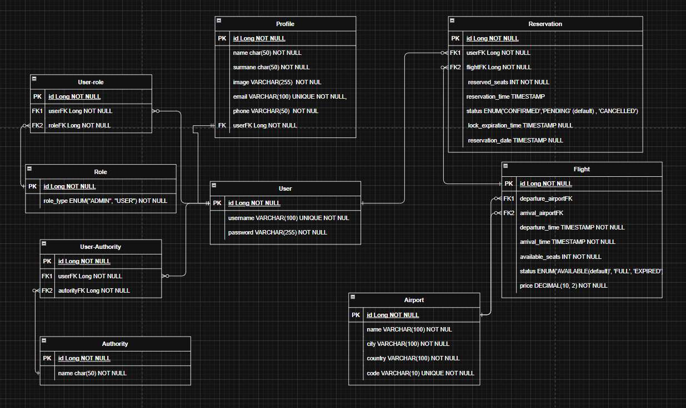

#  ✈️ Airline Management System — REST API

## 📖 Table of Contents
- [Project Description](#project-description)
- [Key Features](#key-features)
- [Project Structure](#project-structure)
- [API Endpoints](#api-endpoints)
- [Working examples](#working-examples)
- [Technologies Used](#technologies-used)
- [Installation and Setup](#installation-and-setup)
- [Unit and Acceptance Tests](#unit-and-acceptance-tests)

---

## 💡Project Description
This project aims to develop an airline management system 
using Spring with Spring Boot and Spring Security. The system will 
enable comprehensive management of users, flights, reservations, 
and destinations, with advanced features such as secure authentication via Basic Auth and JWT. 
The system must not allow the selection of flights without available seats or those 
that have exceeded the deadline. The project will be implemented using Java 21, Maven and PostgreSQL.

## 🚀Key Features
### 👤 User Management
- Register a new user.
- Authenticate users using JWT or Basic Auth.
- Manage user roles (ROLE_ADMIN and ROLE_USER).
- Upload and manage user profile images.

### ✈️ Flight Managementnt
- Automatically generate flights during compilation (via .sql file).
- Update flight status to "unavailable" when seats are full or the deadline is passed.
- Search for flights by departure and destination airports, date, and number of seats.

### 📜 Reservation Management
- Reserve flights only if the selected route exists and seats are available.
- Block seats for 15 minutes during the reservation process.
- View reservation history for each user.

### 🛠️ Admin Features
- CRUD operations for airports and flight routes.
- View summarized lists of reservations made by clients.
---

## 📂Project Structure

The project follows the principle of separation of concerns, using three main layers:
- Controllers: Handle HTTP requests.
- Services: Manage business logic.
- Repositories: Interact with the database.

DTOs are used for data transfer between layers, and global exception handling ensures consistent error responses. Custom exceptions are employed for domain-specific errors, making the codebase maintainable, scalable, and easy to extend.


---

## 📦API Endpoints
URL: http://localhost:8080/api/v1/ + endpoint
### User Endpoints
| Method | Endpoint         | Description                      |
|--------|------------------|----------------------------------|
| GET    | `/login`         | Authenticate a user(basic auth). |
| GET    | `/logout`        | User logout.                     |
| POST   | `/auth/token`    | Authenticate a user(JWT auth)    |
| POST   | `register/users` | Register a new user.             |

### Airports Endpoints
| Method | Endpoint                  | Description              |
|--------|---------------------------|--------------------------|
| GET    | `/public/airports`        | Retrieve all airports.   |
| POST   | `/private/airports`       | Register a new airport.  |
| PUT    | `/private/airports/{id}`  | Update airport details.  |
| DELETE | `/private/airports/{id}`  | Delete an airport by ID. |

### Flight Endpoints
| Method | Endpoint                        | Description                 |
|--------|---------------------------------|-----------------------------|
| GET    | `/public/flights`               | Retrieve all flights.       |
| GET    | `/public/flights/search{param}` | Retrieve flights dy params. |
| POST   | `/private/flights`              | Register a new flight.      |
| PUT    | `/private/flights/{id}`         | Update flight details.      |
| DELETE | `/private/flights/{id}`         | Delete a flight by ID.      |

### Profile Endpoints
| Method | Endpoint                  | Description             |
|--------|---------------------------|-------------------------|
| GET    | `/private/profiles`       | Retrieve all profiles.  |
| GET    | `/public/profiles/{id}`   | Retrieve profile dy ID. |
| POST   | `/public/profiles`        | Register a new profile. |
| PUT    | `/public/profiles/{id}`   | Update profile details. |
| DELETE | `/public/profiles/{id}`   | Delete a profile by ID. |

### Reservation Endpoints
| Method | Endpoint                                       | Description                            |
|--------|------------------------------------------------|----------------------------------------|
| GET    | `public/reservations/history/{id}`             | Retrieve reservations by ID.           |
| POST   | `public/reservations`                          | Add a new reservation.                 |
| PUT    | `/public/reservations/confirmed/{id}`          | Confirmed reservation.                 |
| PUT    | `/public/reservations/cancelled/{id}`          | Canceled reservation.                  |
| DELETE | `/public/reservations/history/clean/{user_id}` | Delete participation connection by ID. |

---

## ✍️Working examples

### Registering a User (Request) 
**POST** `http://localhost:8080/api/v1/register/users`

```json
{
  "username": "111@mail.com",
  "password": "{{base64EncodedPassword}}"
}
```
### Create reservation
**POST** `http://localhost:8080/api/v1/public/reservations`

```json
{
  "reservedSeats": 180,
  "flightId": 2,
  "userId": 2
}
```
### 💻 API Testing
- Use **Postman** or **Insomnia** for testing the API.
- Import the collection of endpoints from the file [utils/airlines.postman_collection.json](src/main/java/com/yuliia/airlines_api/utils/airlines.postman_collection.json).

    
---

## 🛠️Technologies Used
- **Java 21**: Programming language.
- **Spring Boot**: Framework for building REST APIs.
- **Maven**: Build tool.
- **PostgreSQL**: Database, deployed using Docker.
- **Docker**: Used for containerizing the PostgreSQL database.
- **Docker Compose**: Orchestrates multi-container Docker applications.
- **H2 Database**: In-memory database for temporary data storage.
- **JWT**: For secure authentication.
- **Insomnia/Postman**: Tool for testing APIs.

---

## ⚙️Installation and Setup

1. **Clone the repository**:

```bash
git clone https://github.com/YuliiaBi1a/airlines-api
```

2. **Configure the database in the application properties**:
- This project has two different configurations for databases:
- Test Environment (H2 in-memory database): Configured in resources/application-test.yml.
- Development Environment (PostgresSQL via Docker): Configured in resources/application-dev.yml.
- For testing, the application-test.yml contains the configuration for an in-memory H2 database.
- For development, the application-dev.yml contains the configuration for a PostgreSQL database deployed using Docker.

**Here you can see database architecture**



3. **Configure authentication**:

The project includes authentication and authorization mechanisms for private API endpoints, ensuring that only authorized users can access specific resources based on their roles and scopes. Users are authenticated using JWT tokens, and their roles (e.g., ADMIN, CLIENT) and scopes (e.g., "scope:admin", "scope:flight:admin") are validated to grant access to restricted endpoints. Access to private endpoints is controlled by role-based access control (RBAC), where roles define the level of access, while scopes define the specific permissions a user has within those roles. This ensures secure and granular control over the resources, and only users with the appropriate roles and scopes are allowed to perform specific actions on the server.

JWT Auth is used by default.
To generate the key, run the following command in the terminal:
```bash
openssl rand -base64 64 > hs512_key.txt
```
Then save the key as an environment variable in the .env file.

In order to try basic authentication, go to the feature/login frame. To do this, enter the following command in the terminal
```bash
git switch feature/login
```

4. **Run the application**:
   To run the application, first, make sure you have the correct profile active. You can specify the active profile by adding the following to your application.properties (or application-dev.yml and application-test.yml for environment-specific settings):
   -For test environment:
```bash
mvn spring-boot:run -Dspring.profiles.active=test
```
-For development environment:
```bash
mvn spring-boot:run -Dspring.profiles.active=dev
```
---
### 🚀 CI/CD Pipeline
This project uses GitHub Actions for continuous integration and continuous deployment (CI/CD). There are two separate pipelines configured for testing and development environments:

- **Test Pipeline (H2 Database)**: This pipeline runs the unit and integration tests using an in-memory H2 database. It ensures that the project works correctly in a test environment.

- **Development Pipeline**: This pipeline runs in a development environment, where the project is built and deployed with a PostgreSQL containerized database using Docker. It tests the application in a more realistic environment.

Both pipelines ensure that any changes made to the repository are properly tested and validated before being deployed.

---
### 🛠️ Setting Up Docker Compose
*To run the PostgreSQL database with Docker for the development environment, you can use Docker Compose.*

1. Install Docker if you haven’t already.

2. Create a Docker Compose configuration: In your project, there should be a docker-compose.yml file for configuring and starting the PostgreSQL container.

Example docker-compose.yml:

```yaml
version: '3.8'
services:
  db:
    image: postgres:17
    container_name: airlines_postgres_db
    environment:
      POSTGRES_USER: adm
      POSTGRES_PASSWORD: adm
      POSTGRES_DB: squid_game_db
    ports:
      - "5432:5432"
    volumes:
      - postgres_data:/var/lib/postgresql/data
    networks:
      - springboot_network

volumes:
  postgres_data:

networks:
  springboot_network:
```
3. Run Docker Compose:

After setting up docker-compose.yml, you can start the PostgreSQL container with the following command:

```bash
docker-compose up
```
This command will download the necessary PostgreSQL image, start the container, and expose the database on port 5432.

4. Run the application with the development profile:

After PostgreSQL is up and running, you can start the application in development mode with:

```bash
mvn spring-boot:run -Dspring.profiles.active=dev
```

---

## 🧪Unit and Acceptance Tests

The project includes both unit tests and acceptance tests to ensure the correctness and reliability of the application. Unit tests are written using JUnit 5 and focus on testing individual components such as services and helper methods. MockMvc is used for testing the REST API endpoints, allowing for the simulation of HTTP requests and validation of responses without actually starting a server. Acceptance tests ensure that the system works as expected in an integrated environment, testing the full flow of data and interactions between components. Mockito is used for mocking dependencies in unit tests to isolate the logic and make the tests more efficient and focused.

Additionally, security and authentication tests are implemented to verify access control and token validation. These tests cover scenarios such as role-based access to protected resources, JWT token generation and processing, and validation of data, as well as the cleaning of outdated records through API calls.
---

---
#### Project made by [Yuliia Bila](https://github.com/YuliiaBi1a) like part of Bootcamp ESVAL6 Backend & AWS Cloud
( ˶ˆ ᗜ ˆ˵ ) 
